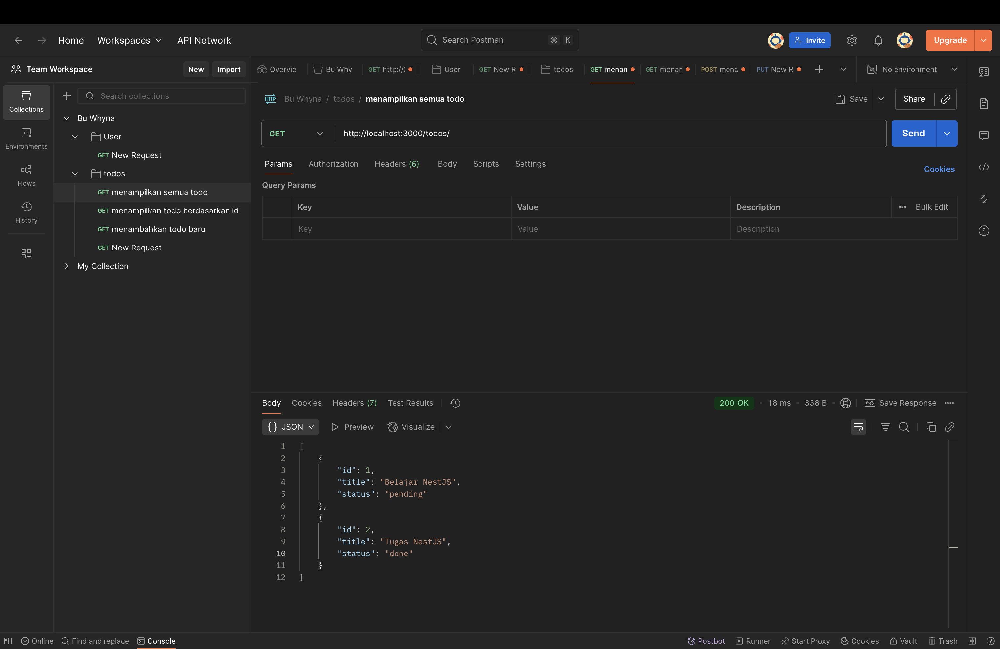
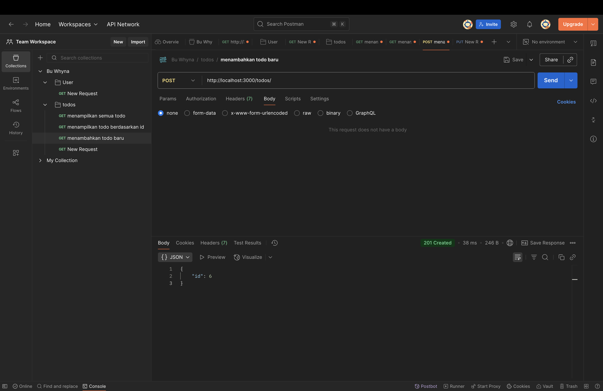
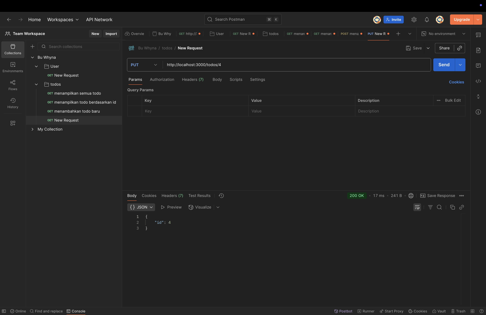
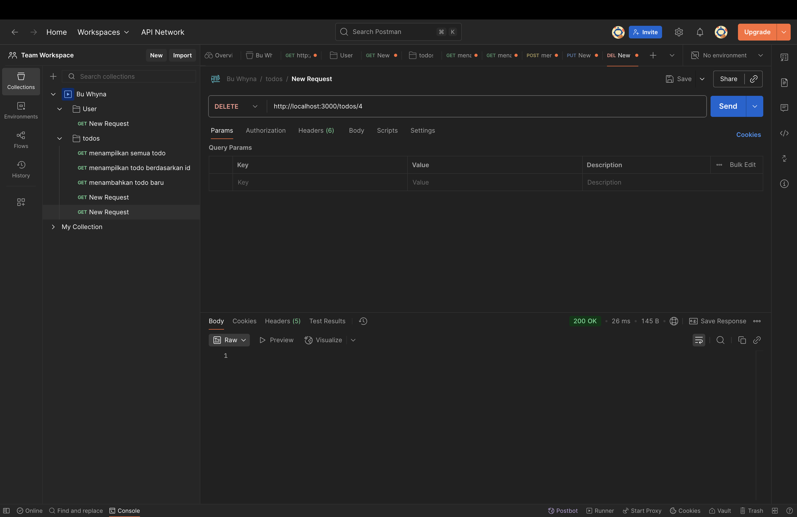

# 📝 API Todo List - NestJS

API ini adalah implementasi sederhana Todo List menggunakan **NestJS** tanpa database.
Semua data disimpan di dalam array agar mudah dipahami dan diujikan menggunakan **Postman**.
Proyek ini dibuat untuk memenuhi tugas pembuatan API Todo List, dengan endpoint CRUD dasar.

## 👤 Identitas
Nama: Muhammad Rafi Haikal
Kelas: XI RPL 1

## 📜 Deskripsi
API Todo List sederhana menggunakan NestJS tanpa database. Data disimpan di dalam array.

## ✨ Fitur Utama
- **GET /todos** → Menampilkan semua todo
- **GET /todos/:id** → Menampilkan todo berdasarkan ID
- **POST /todos** → Menambahkan todo baru
- **PUT /todos/:id** → Mengupdate todo berdasarkan ID
- **DELETE /todos/:id** → Menghapus todo berdasarkan ID

## 🗂️ Struktur Data
Setiap todo memiliki struktur data berikut:

{
  "id": number,
  "title": string,
  "status": "pending" | "done"
}

## 🖼️ Screenshot

